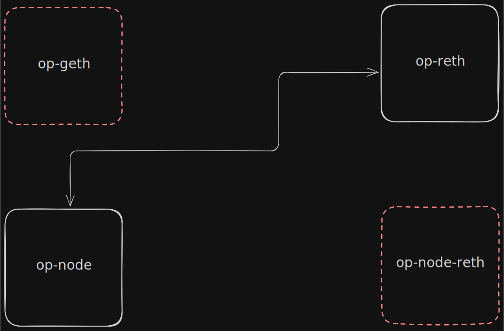

# Migrate from op-geth to op-reth

This guide walks through the steps to migrate a chain's execution client from **op-geth** to **op-reth**.

## Part 1: Synchronize op-reth


### 1. Update the op-stack components

Make sure you are running the latest supported versions before proceeding with the migration. Refer to the [component versions](https://github.com/agglayer/runbooks/tree/main/cdk/op-stack#component-versions) table for the currently recommended versions.

### 2. Enable P2P on op-geth and op-node

If P2P is not already enabled, update the startup flags for both services.

**op-geth:**

```shell
geth [global options] command [command options] \
  --port=<port>
```

**op-node:**

```shell
op-node [global options] command [command options] \
  --p2p.disable=false \
  --p2p.listen.tcp=<port> \
  --p2p.priv.path=<path-to-data-dir>/opnode_p2p_priv.txt
```

### 3. Retrieve the sequencer enode

Get the enode URI from `op-geth`. This will be used to connect the new `op-reth` node to the sequencer.

```shell
cast rpc admin_nodeInfo --rpc-url <op-geth-rpc-url> | jq .enode
```

### 4. Retrieve the op-node peer ID

Get the peer ID from op-node.

```shell
cast rpc opp2p_self --rpc-url <op-node-rpc-url> | jq .peerID
```

### 5. Run op-reth + op-node

With the following setup, synchronization is delegated to the execution layer. This skips the L1 derivation process, allowing for faster syncs.

**op-reth:**

```shell
op-reth node [OPTIONS] \
  --port=<port> \
  --max-outbound-peers=1 \
  --max-inbound-peers=1 \
  --trusted-only \
  --bootnodes=enode://<enode-address> \
  --trusted-peers=enode://<enode-address>
```

**op-node-reth:**

```shell
op-node [global options] command [command options] \
  --syncmode=execution-layer \
  --l2.enginekind=reth \
  --l2.engine-rpc-timeout=600s \
  --p2p.static=/dns4/<op-node-domain>/tcp/<op-node-p2p-port>/p2p/<op-node-peerID>
```

Wait until `op-reth` fully synchronizes. The `op-node-reth` logs will output something like:

```
Finished EL sync
```

## Part 2: Migration



### 6. Scale down dependent services

Scale down `aggkit`, `zkevm-bridge`, `op-succinct-proposer`, and `aggkit-prover`.

### 7. Stop sequencing

```shell
cast rpc admin_stopSequencer --rpc-url <op-node-rpc-url>
```

### 8. Wait for finalization

Wait until all safe blocks are finalized.

### 9. Scale down op-batcher and op-node

### 10. Remove the old stack

Delete `op-geth` and `op-node-reth`.

### 11. Reconfigure and restart the stack

1. Point `op-node` to `op-reth`
2. Disable P2P on `op-reth` and `op-node` (reverse of [step 2](#2-enable-p2p-on-op-geth-and-op-node))
3. Remove the synchronization flags from `op-reth` and `op-node` that were added in [step 5](#5-run-op-reth--op-node)
4. Start `op-reth`, `op-node`, and `op-batcher`
5. Update `aggkit`, `zkevm-bridge`, `op-succinct-proposer`, and `aggkit-prover` to point to `op-reth` and start them.

> ⚠️ **Important:** The `--rpc.eth-proof-window` flag must be set to a high value, as it is required by
