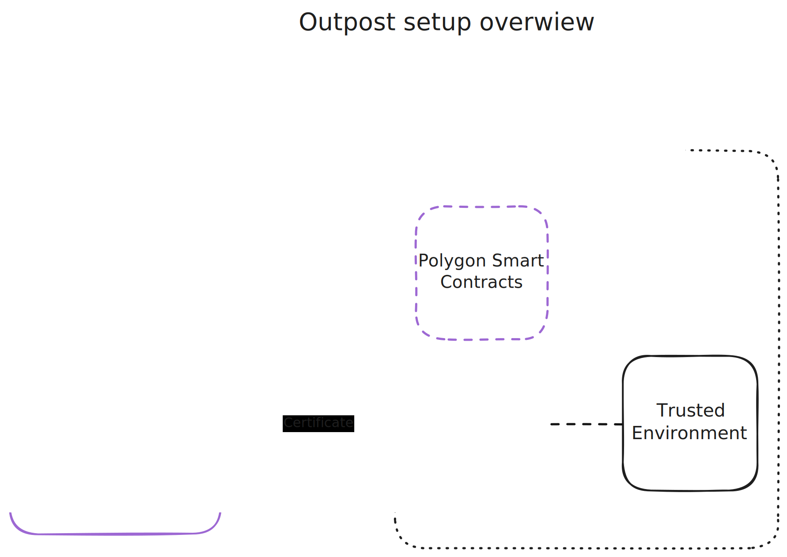
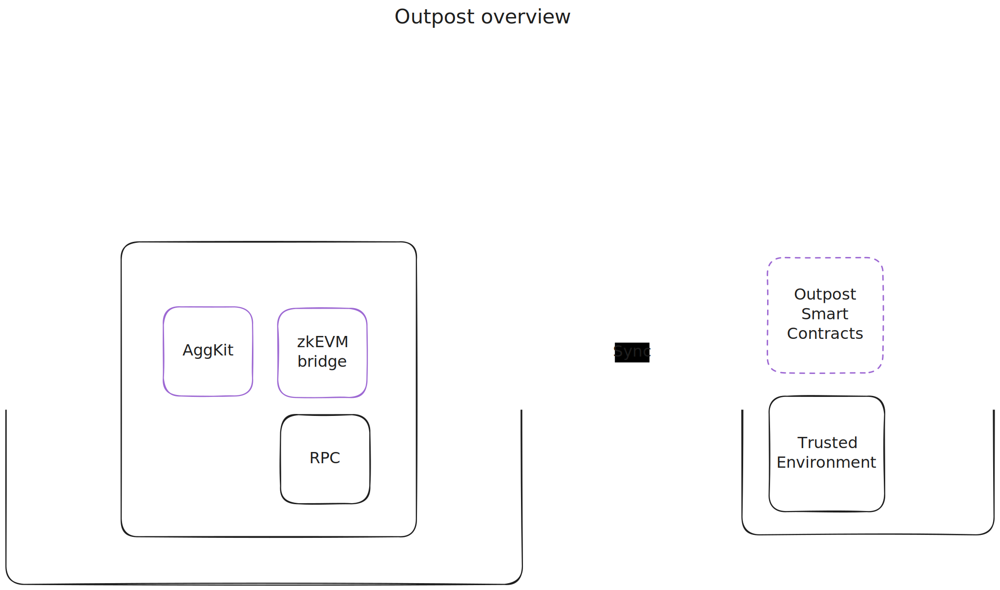
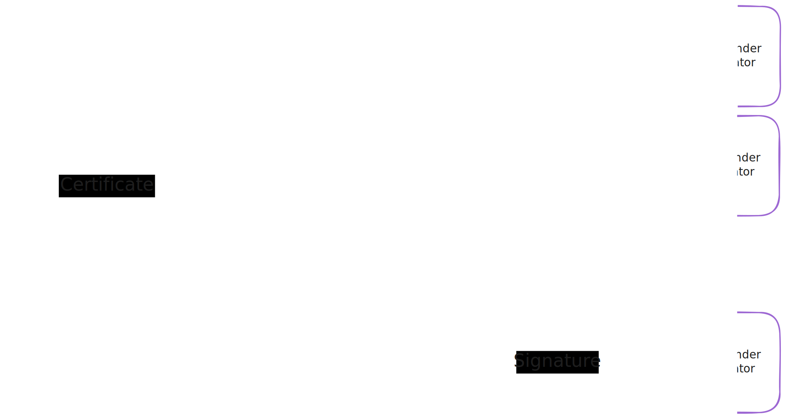
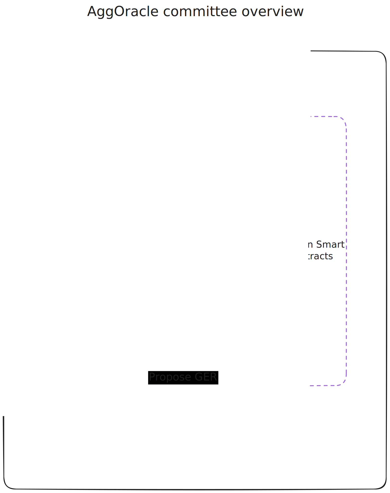

# Outpost Configuration Reference
## Data Sources

| Data | File |
|------|------|
| L1 info | `combined.json` |
| L2 info | `outpost.json` |

## Overview

The outpost setup consists of three core components:

1. **Layer 1** — Sepolia or Ethereum mainnet
2. **[Agglayer](https://www.agglayer.dev/)** — Aggregation layer
3. **Layer 2:**
   - **[Polygon smart contracts](https://github.com/agglayer/agglayer-contracts/tree/develop/tools/deployOutpostChain)**
   - **Agglayer components**: The bridge between Agglayer and non-native chain
   - **Trusted environment** — A non-native Agglayer chain

The diagram below provides a detailed view of the outpost architecture:

**On Layer 2:**
- **Trusted environment** — The collection of components to run a non-native Agglayer chain
- **[Polygon smart contracts](https://github.com/agglayer/agglayer-contracts/tree/develop/tools/deployOutpostChain)** — Deployed on the L2 chain
- **Agglayer components:**
  - **[zkEVM Bridge](https://github.com/0xPolygon/zkevm-bridge-service)** — Enables asset bridging between Ethereum L1 and L2 networks connected to the Agglayer
  - **[AggKit](https://github.com/agglayer/aggkit)** — Modular framework for connecting networks to the Agglayer
  - **RPC Node** — Synchronizes state from the trusted environment

To enhance security, multiple AggKit instances can be distributed across different entities to form a committee.

## AggKit Configuration
AggKit can run different processes: AggOracle, AggSender, AggSender Validator, and Bridge. The core ones for outposts are:

- **[AggSender (Proposer)](https://github.com/agglayer/aggkit/blob/develop/docs/aggsender.md)** — Acts as certificate proposer and submits to the Agglayer
- **[AggSender Validator](https://github.com/agglayer/aggkit/blob/develop/docs/aggsender_validator.md)** — Provides certificate validation
- **[AggOracle](https://github.com/agglayer/aggkit/blob/develop/docs/aggoracle.md)** — Propagates Global Exit Root (GER) from L1 to the L2 sovereign chain

### AggSender

#### Common Configuration
| Config | Value | Reference |
|--------|-------|-----------|
| `AggOracle.EVMSender.EthTxManager.Etherman.L1ChainID` | Must match the **outpost chain**, not the rollup chain ID | [default.go#L137](https://github.com/agglayer/aggkit/blob/develop/config/default.go#L137) |

#### Proposer
| Config | Value | Reference |
|--------|-------|-----------|
| `AggSender.ValidatorClient.UseTLS` | `true` | [default.go#L267](https://github.com/agglayer/aggkit/blob/develop/config/default.go#L267) |

#### Validator
| Config | Value | Reference |
|--------|-------|-----------|
| `Validator.EnableRPC` | `true` (must be publicly reachable) | [default.go#L297](https://github.com/agglayer/aggkit/blob/develop/config/default.go#L297) |

### AggOracle

| Config | Value | Reference |
|--------|-------|-----------|
| `L2Config.AggOracleCommitteeAddr` | Configure the committee address | [default.go#L34](https://github.com/agglayer/aggkit/blob/develop/config/default.go#L34) |
| `AggOracle.EnableAggOracleCommittee` | `true` | [default.go#L110](https://github.com/agglayer/aggkit/blob/develop/config/default.go#L110) |
